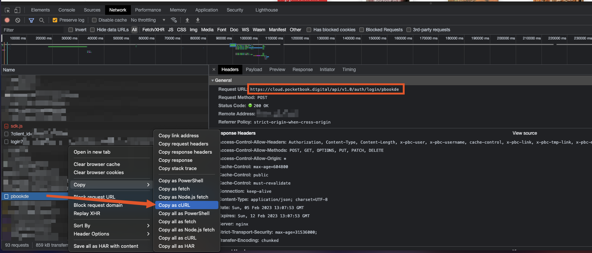

# pocketbook2readwise
A stateless script to export all you notes & highlights from Pocketbook Cloud to Readwise.

## Prerequisites
Before actually using the script, you need to extract your Pocketbook Cloud auth credentials.  
I did not do much reverse engineering, and my auth approach may not be suitable for your account.  
Feel free to contribute to this repository.

### 1. Configure a HTTPS interceptor
It can be DevTools for your browser, Charles, Fiddler, or any other proxy that can 
intercept encrypted HTTP traffic.

### 2. Go to [the login page](https://cloud.pocketbook.digital/browser/en)

### 3. Authorize, then find an auth request
... which should look like this:

Please note that login provider (`pbookde` on the screenshot above) can differ. 

... and press "Copy as curl".

Then paste it anywhere, and copy the request body (urlencoded form):

I hope that those credentials will not become invalid over time.  
If your credentials have been invalidated — you can still debug how has it happened, 
and implement a refresh mechanism yourself.

### 4. Generate your Readwise Access Token
Now that we're done with Pocketbook Cloud, let's [generate a token](https://readwise.io/access_token) 
that will be used to export your highlights to Readwise.

### 5. Set environment variables
#### `POCKETBOOK_LOGIN_DATA` — form data you have copied at the step 3
#### `POCKETBOOK_LOGIN_PROVIDER` — 
#### `READWISE_TOKEN` — token you have copied at the step 4

## Usage scenarios
You can host it anywhere, whether it's an AWS Lambda, n8n, or a raw crontab task 
that triggers a Python script.

My current workflow is configured and hosted on [Pipedream](https://pipedream.com), 
even though their Python executor is currently in Alpha, and can be very buggy. 

Since the script is stateless, it doesn't require any database or file storage. 
It fetches an entire collection of highlights & notes every time it is executed.  

